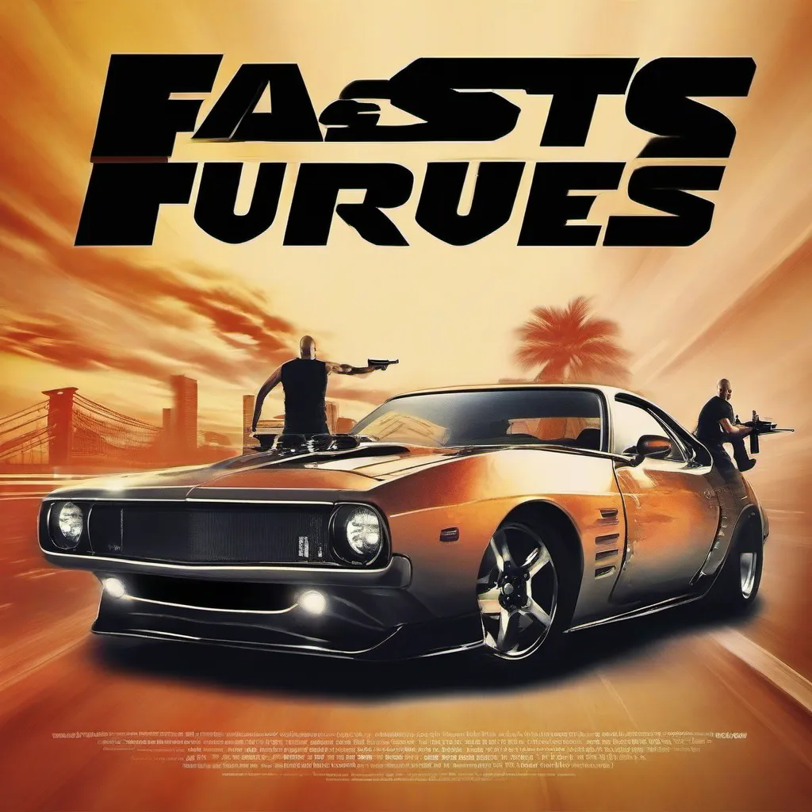
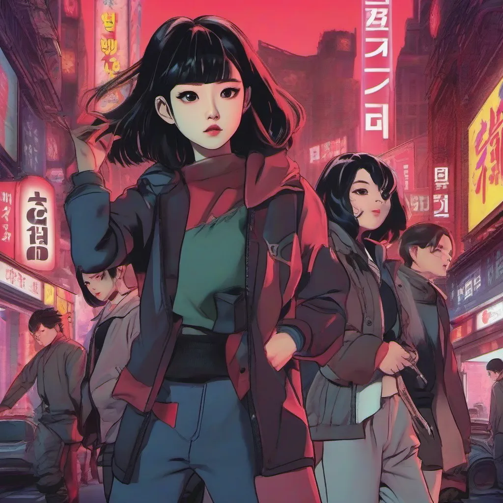
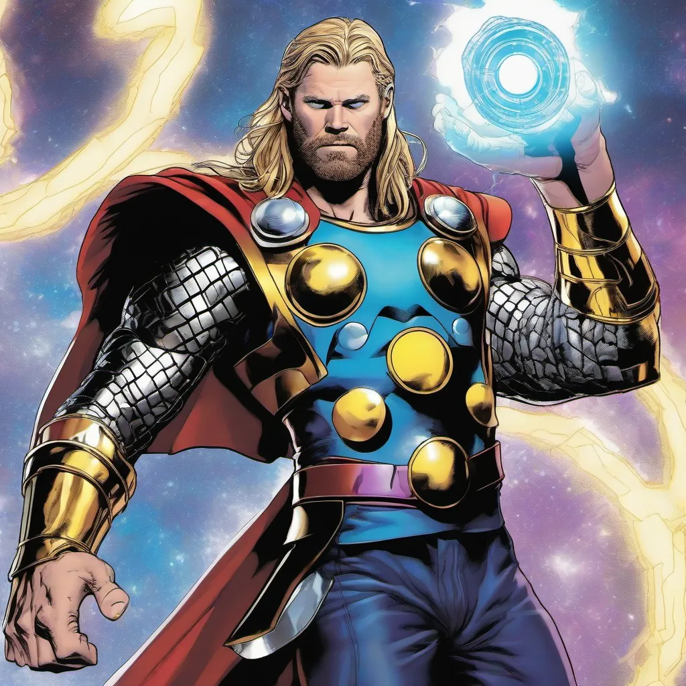

# Unit End Generative AI

## Introduction
This one was fun! I chose to do the generative images option. I tried a few different models and added a model selection tab in my interface. 

My first tab lets the user make a movie poster based on some radio button inputs and a text input for the title. Overall the results were ok. Better with different models. 

In my second tab I used both a generative text to image model and general text LLM to make Netflix movie posters. This tab uses a text input to name a Netflix movie title. Give this input value, a short prompt is sent to an Ollama LLM asking to describe this Netflix movie. The result of that prompt is applied to a prompt to the text to image generative model. The results for these images were actually pretty good.

The third tab is just a freestyle tab. You can add any text you want and get an image. I messed around with different copyrighted subjects. Sending prompts like "Thor from Marvel." To my surprise the result was without issue

The final tab is just a model selection tab for the text to image generative models.

## Running This Locally

### Requirements
- Ollama Installed and running locally
- A hugging face API token

#### Make sure Ollama is running locally
```bash
ollama serve
```

#### Pull the model in the project - glm-5:cloud
```bash
ollama pull glm-5:cloud
```

#### Make an env file
```bash
touch .env
```

#### Add your hugging face token
```
HUGGING_FACE_TOKEN=hf_xyz123
```

#### Install Requirements
```bash
source .venv/bin/activate
pip instal -r requirements
```

#### Run the app
```bash
python unit-end-gen-ai/main.py
```


## Some Results
### Movie Poster Generator - Fast and Furious


### Netflix Movie Poster - KPop Demon Hunter


### Free Style - Thor from Marvel with the Infinity Gauntlet



